# Classic vs. Calm client layout — comparison report

Produced 2026-07-08 per `docs/layout-comparison-prompt.md`. Method: code pass
over both surfaces in `app.js`; UI pass with the mock harness
(`scripts/calm-ui-harness/`, two-pet trialing account, identical data in both
layouts, 390×844 and 1280×850); task walkthroughs scored on both.
Screenshots in `docs/img/`.

## Verdict

The two layouts are not competitors — they are different answers to
different questions. Classic answers *"what is all the information about my
pet?"* and is the only place eight-plus real capabilities live (documents,
health charts, knowledge base, settings, add-pet, referral, attachments,
co-owners). Calm answers *"what should I do right now, and am I okay?"* and
does it dramatically better: fewer taps for the common tasks, a coherent
emotional register, and none of classic's density bugs. Calm is the better
**default home**, but it cannot become the default for all clients yet —
today it depends on classic as its escape hatch for roughly a third of real
owner tasks, and two of those (add a second pet, view a shared document)
currently dead-end entirely inside calm.

---

## Classic layout

**Strengths**

- **Feature-complete.** Every owner capability in the product is reachable:
  the care-plan body (`renderCarePlanBody`) carries appointments (ICS
  download, video-call join), medications, vitals with a Chart.js weight
  trend, vaccines (client-writable), documents & files (upload with type +
  source clinic, plus client-triggered AI summarize), diagnoses, open
  questions, care goals, co-owners/helpers, external providers, and genetic
  insights. The dashboard (`renderClientDashboard`) adds a structured owner
  check-in (sleep/eating/movement ratings + reflection), a vet-visit-prep
  PDF, care-team invites, and community features; the chrome adds the AI
  knowledge-base chat, health timeline, referral dashboard, notifications
  panel, dark mode, and profile settings (password, check-in privacy
  toggle, delete account).
- **Messaging is zero navigations.** The conversation card sits at the top
  of the care plan a client lands on (`classic-careplan-390.png`).
- **Desktop-aware.** At 1280px classic gets a real sidebar, a multi-case
  "My Cases" list with pet avatars, and sensible width usage
  (`classic-careplan-1280.png`). Multi-pet owners see both pets at all
  times.
- **Richer composer.** Voice notes and file attachments in messages
  (`classic-messages-390.png`); calm's composer is text-only.
- **State honesty.** The recipient banner ("This message goes to: Maya Chen
  + Dr. Rodgers") is a genuinely good trust affordance calm lacks.

**Weaknesses**

- **Density reads as anxiety.** With an almost-empty account, login still
  presents: a back button, an edit row, a coach-mark tooltip, a PWA install
  banner, a plan chip, a next-visit chip, and an empty-state conversation —
  before any content the owner asked for. The tooltip and install banner
  visibly collide at the bottom of the viewport
  (`classic-careplan-390.png`).
- **Bottom nav is over-packed.** Five items with wrapping two-line labels
  ("Knowledge Base", "Health Timeline", "Share Vet Buddies") at 390px.
- **Unguarded data leaks into UI.** The appointment card renders
  `${appt.type}` without a fallback — a typeless appointment shows a chip
  reading literally "undefined" (`classic-careplan-scroll-390.png`,
  `renderAppointmentsTab` ~app.js:7085). The adjacent color lookup IS
  guarded; the label isn't. Also raw "12:00 AM" for date-only visits.
- **Tonal drift — gamification half-life.** The dashboard still renders an
  XP bar with multiplier, streaks, badge shelves, community score, and
  "🏆 Celebrate a Win", while `awardCareXP` was deliberately stubbed to
  zero queries ("misaligns with SHARE/SUPPORT/BRIDGE"). Classic shows
  owners a progress system the product no longer feeds. The same owner
  gets two contradictory product philosophies depending on layout.
- **Clients are told to use navigation they don't have.** The onboarding
  coach-mark says "scroll down or use the section tabs," but the
  care-plan section nav (`careplan-section-nav`) renders only for staff
  (`canEdit`) — clients get one flat, very long page with no section
  navigation at all. Reaching vitals or documents is many screen-heights
  of scrolling past mostly-empty sections.

## Calm layout

**Strengths**

- **Task speed where it counts.** Today's med focus: 0 taps (it *is* the
  landing screen). Visit prep with inline add-question: 1 tap
  (`calm-visits-390.png`). Billing from the Today links: 1 tap. Message the
  Buddy: 2 taps. Every one of these beats or ties classic without any
  scrolling.
- **One coherent voice.** "One thing to hold today", the honest 7-day
  strip, heavy-mode ("Then let's set it all down"), memorial mode, the
  private owner check-in — the layout is an argument for what the product
  is (SHARE / SUPPORT / BRIDGE), not just a skin
  (`calm-today-390.png`, `calm-buddy-390.png`).
- **Progressive disclosure done right.** The bridge screen shows exactly
  what will be shared with the vet and requires explicit owner approval
  (`calm-bridge-390.png`); nothing equivalent exists in classic.
- **Graceful degradation.** Trial expiry is a quiet read-only note in the
  composer plus a billing link — no paywall wall, records stay visible.
- **Fewer failure modes.** Because screens are curated, calm shows no raw
  fields, no empty-section skeletons, no chip soup.

**Weaknesses**

- **Curation becomes concealment at the edges.** No calm surface at all
  for: documents & files (an owner tapping "the clinic uploaded Percy's
  bloodwork" has nowhere to go), weight/vitals history (health snapshot
  shows latest weight only — no chart), knowledge base, referral, timeline,
  co-owners, genetic insights, notification/profile/password settings.
- **Two outright dead ends.** (1) Add a second pet: the only calm add-pet
  entry is the zero-pet welcome screen (`renderCalmNoPet`); an owner with
  one pet has no path to add another without switching to classic. (2) Any
  document link.
- **Text-only composer.** Calm can *display* photo/voice attachments
  (`renderCalmBubble`) but cannot send them — a worried owner wanting to
  send a photo of a wound must switch layouts.
- **Hardcoded copy.** The Buddy tab prints "2nd-year vet student" for every
  buddy (`renderCalmBuddy`, app.js:4185) — wrong the moment a buddy isn't
  one.
- **Phone column on desktop.** At 1280px calm is a centered 480px strip
  with a bottom tab bar (`calm-today-1280.png`). Fine for a PWA, feels
  unfinished in a browser.
- **Escape hatch is session-only.** "Switch to classic view" resets on
  refresh; an owner who prefers classic must re-opt-out every visit.
- **Nudges are synthesized.** The bell screen derives its items from
  loaded state rather than the notifications system; it can't show
  anything the four calm loaders didn't fetch.

---

## Feature-parity matrix

| Classic capability | Calm equivalent | Assessment |
|---|---|---|
| Conversation w/ Buddy (text) | Message sub-screen | Parity |
| … with attachments / voice notes | Display-only | **Gap** — blocks default |
| Recipient banner ("goes to Maya + Dr. Rodgers") | — | Gap (small, adopt) |
| Appointments list + ICS + video join + edit/cancel | Next-visit line + visit prep | Partial — intentional (owner rarely needs ICS/edit), but video **join** link matters — **gap** |
| Open questions for visit | Visits tab, inline add | Parity (calm better) |
| Medications list | Care tab "Daily care" | Parity |
| Vitals history + weight chart | Latest weight only | **Gap** for chronic-condition owners |
| Vaccines + due dates (client can add) | One "next vaccine" row, read-only | Partial — acceptable |
| Documents & files (view/upload/AI summarize) | — | **Gap** — blocks default |
| Timeline / "Notes from your Buddy" | — | Intentional omission (staff artifact) — defensible |
| Care goals (client adds via dashboard) | "Following up" rows | Parity (read-only is fine) |
| Owner check-in (ratings + reflection, share toggle) | Wellness sub (reflection only) | Near-parity — calm dropped scores on purpose |
| Pet care story | Story sub (+ memorial mode) | Parity — calm better |
| Vet-visit-prep PDF | Bridge screen (on-screen, no PDF) | Partial — bridge covers the intent |
| Celebrations / XP / streaks / badges | — | Intentional — calm's whole thesis; remove from classic instead |
| Community & care requests, helper invites | — | Undecided — omission fits calm's voice, but it's a whole feature set with no calm answer (open question) |
| Co-owner management | — | Gap (rare task; classic fallback acceptable if reachable) |
| Genetic insights | — | Intentional omission — defensible |
| Knowledge base (AI chat) | — | **Gap** — high-value, no calm answer |
| Health timeline view (charts) | — | Same as vitals gap |
| Referral / Share Vet Buddies | — | Intentional — right call |
| Add pet (with pets > 0) | — (only on zero-pet screen) | **Dead end — blocks default** |
| Profile / notification / password settings | — | **Dead end — blocks default** |
| Notifications panel (real records) | Derived "gentle nudges" | Partial |
| Dark mode | Pinned light (documented choice) | Accept as design; revisit only if owners ask |
| Subscription management | Billing sub-screen | Parity (calm better) |
| Multi-pet switching | Chip switcher on Today | Parity |
| Trial-expired handling | Soft read-only | Calm better |

## Task walkthroughs (taps from login, same account)

| Task | Classic | Calm |
|---|---|---|
| See today's meds | 1 (scroll to section) | **0** — landing focus |
| Message the Buddy | **0–1** (composer on landing page) | 2 |
| Next visit + add a question | 1–2 (scroll; question via goals/questions section) | **1** |
| Find an uploaded document | 1 (scroll to Documents) | **✗ dead end** |
| Weight history | 1 (Health Timeline tab) | **✗** (latest value only) |
| Update billing | 2 (profile → subscription) | **1** |
| Add a second pet | 1–2 (Back to Cases → add) | **✗ dead end** |
| Trial-expired experience | Banner + blocked writes + paywall edge | Quiet read-only, records visible — **better** |

## Recommendations (ranked)

**Calm should adopt**
1. An add-pet entry (Today header or pet-chip row "+") — trivial, removes a
   dead end.
2. A Documents row on the Care tab (read + upload) — the single biggest
   real-world gap; owners get sent files by the practice.
3. Attachments/voice in the calm composer — the machinery exists in the
   send-message handler already.
4. The recipient banner in the message sub-screen (one line, big trust win).
5. A "More" or profile sub-screen linking: settings, weight chart, knowledge
   base — calm-styled doorways, not rebuilt features.
6. Fix hardcoded "2nd-year vet student" → derive from the buddy row.
7. Persist the classic opt-out (localStorage, not session state).

**Classic should adopt**
1. Calm's guarded rendering habits — fix the `undefined` appointment-type
   chip and date-only midnight display.
2. Calm's tone decisions: retire the dead gamification layer (XP bar,
   streaks, badge shelves, "Celebrate a Win") — `awardCareXP` no longer
   feeds it, so it's a progress system frozen in time.
3. Give clients the care-plan section nav (it exists; it's gated to staff)
   — or stop telling them to use it in the coach-mark.
4. Bottom-nav diet: 4 items, short labels (calm's nav proves it works).

**Blockers before calm becomes the default for all clients**
1. Add-pet dead end (adopt #1).
2. Documents access (adopt #2).
3. Settings access — password/notifications must be reachable (adopt #5).
4. Attachment sending (adopt #3) — owners send wound/food photos constantly.
5. Video-visit join link surfaced in Visits when an appointment has one.

Items 1–3 are small; 4–5 are moderate. Everything else can ship after the
flip.

## Open questions for Jake

- Desktop: is a centered phone column acceptable for calm long-term, or
  should calm get a two-column desktop arrangement (content + persistent
  Buddy/messages rail)?
- Should the knowledge base (AI chat) get a calm-voiced entry point, or is
  it deliberately out of the calm experience?
- Community & care requests / helper invites: does this feature set have a
  future in calm's voice, or is it classic-only (or retired) going forward?
- When calm becomes default, does classic remain a permanent "full records"
  mode (recommended: yes, relabeled "All records"), or eventually retire?
- Housekeeping found along the way: `hasFeatureAccess` is hard-stubbed to
  `true` (DEV_OVERRIDE, app.js ~5107), so all tier gates are effectively
  open in production right now. Intentional for launch?

## Appendix — screenshots (identical stub data, `docs/img/`)

| Calm | Classic |
|---|---|
| 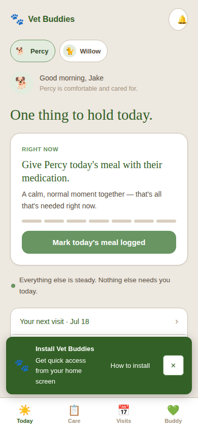 | 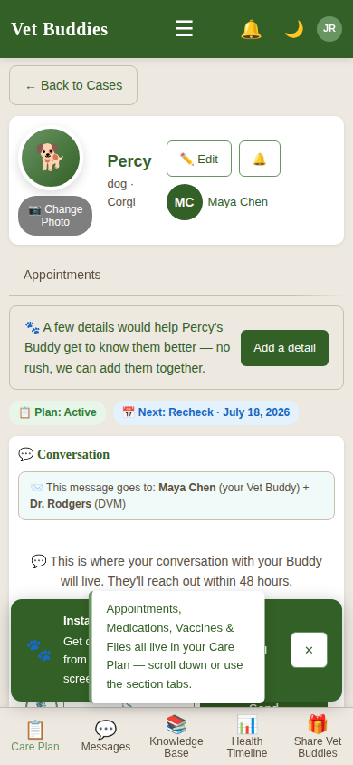 |
| 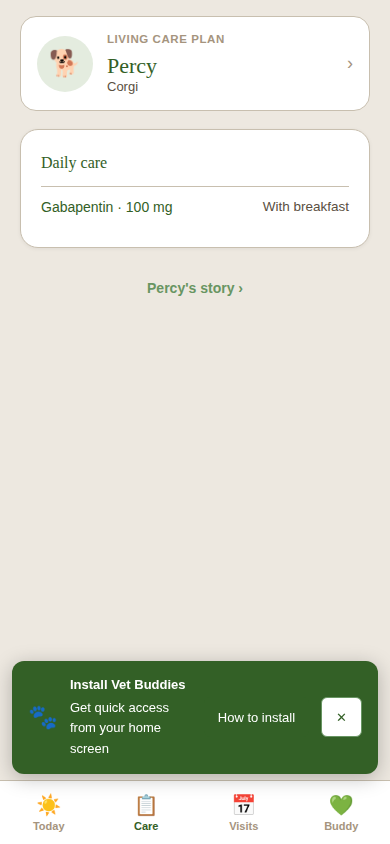 | 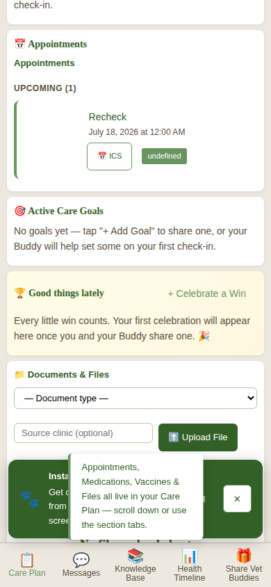 |
| 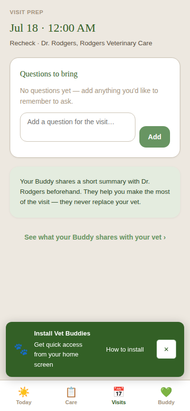 | 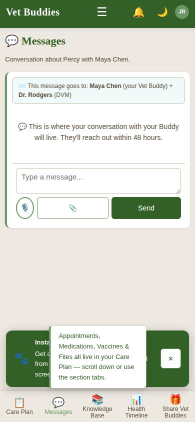 |
| 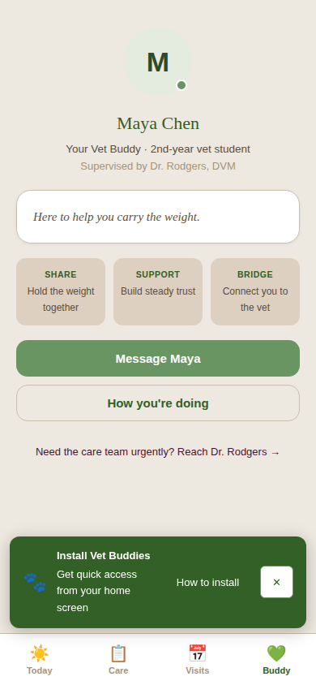 | |
| 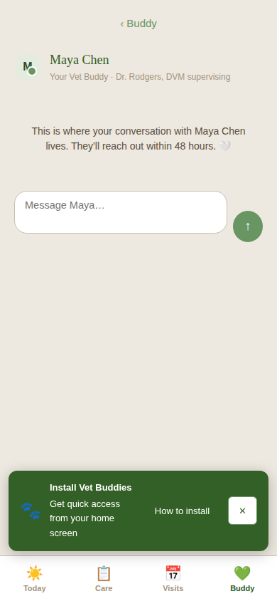 | |
| 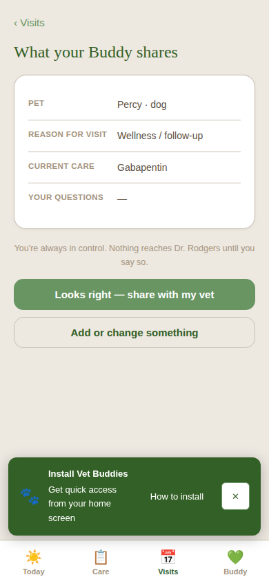 | |

Desktop: 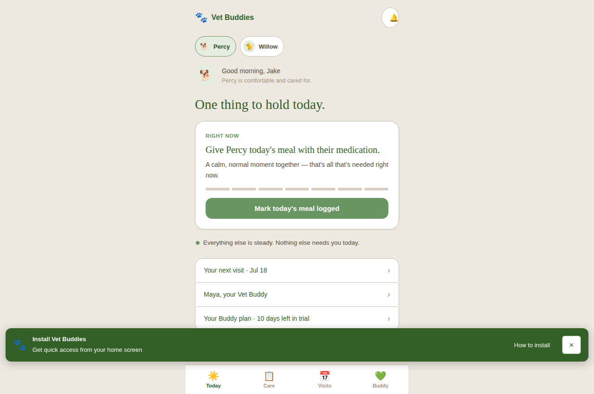
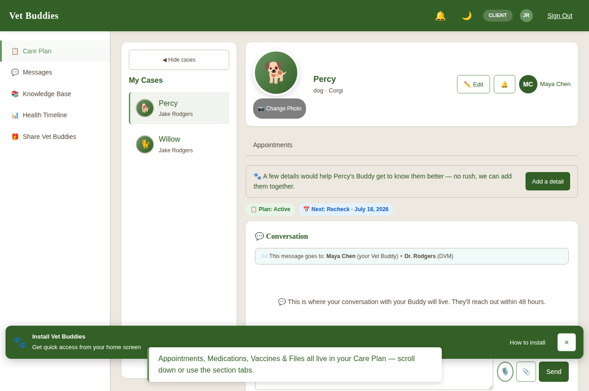
